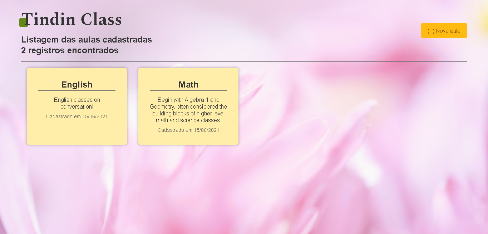
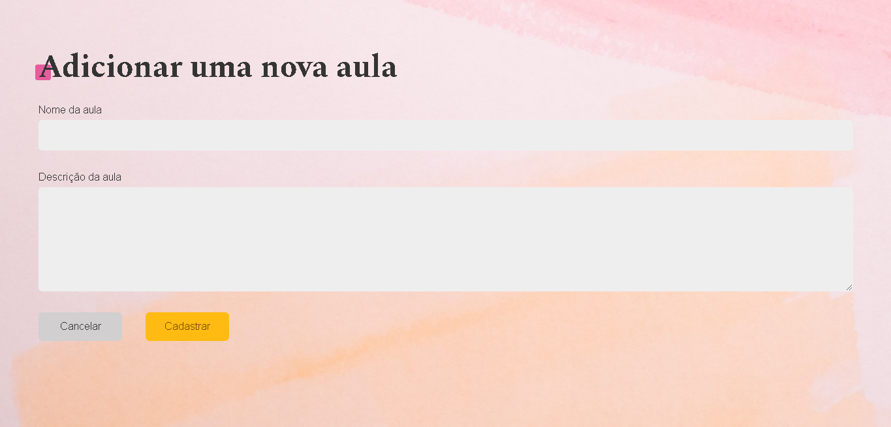
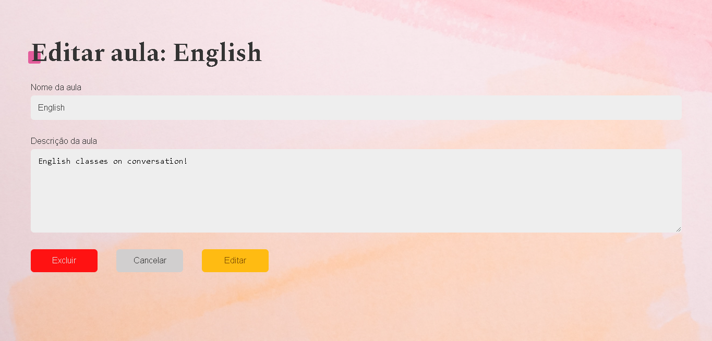

# crud-frontend
Crud frontend with html, css and js!

Login area:

If the API returns OK, its can login, otherwise the login is wrong.

  

Classes:

List of all registered classes!

  

Register:

Register the classes!

  

Edit or delete:

Edit or delete the classes!

  

